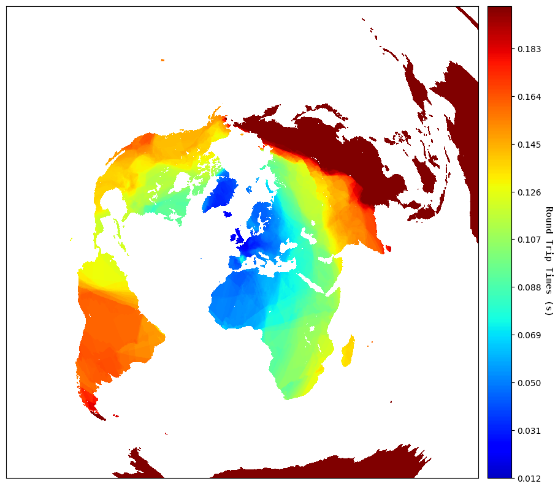

*[Map: Measuring the latency of 574k servers around the world from my Lemmy server in London](https://martijn.sh/?post=5074952)*

## Code / Scripts

These scripts are provided as is and are a part of research on my [blog](https://martijn.sh/). I've made them partly configurable with CLI, but there are also hard-coded changes required if you're planning on using them yourself.

These where used to test the load times of deployements on different CDNS and plot a heatmap of the world.

### CDN Test
#### ping.py

Interface with GlobalPing's CLI tool, it completes a https request for every subdomain or different deployement from every continent equally with many rate limiting options.

#### parseGlobalPing.py

Parses all files generated by GlobalPing during ping.py, calculate averages, and returns this data in pretty print or CSV (I'm partial to a good spreadsheet...). Easy to tweak with CLI arguments.

### Heatmap

#### masscan - discovery

    # masscan 0.0.0.0/4 -p80 --output-format=json --output-filename=Replies.json --rate 10000
 
Scans slightly less than the entire internet for servers with an open port 80, traditionally used for serving a website or redirect.

#### hpingIps.sh - measurement

Due to masscan not recording RTT's, I used hping for the measurements. Nmap is a good choice as wel but hping is slightly faster. I've found [MassMap](https://github.com/capt-meelo/MassMap) after my scan, which would allow for measurements in the same step as the discovery.

This is a quick and dirty script to use hping and send one packet to port 80 of any host discovered by masscan.

#### query.py - parse and locate

Primary and original function is to query the [GeoLite2](https://dev.maxmind.com/geoip/geolite2-free-geolocation-data/) database with an IP-address to give a rough estimate of their physical location to plot a heatmap. Now it can also estimate the distance between my server and another using Haversine.

#### plot.py

Creates heatmap with the output of query.py (longitude, latitude, and RTT) using [Matplotlib](https://matplotlib.org)

query.py and plot.py are forked from [Ping The World!](https://github.com/erikbern/ping) by [Erik Bernhardsson](https://erikbern.com/2015/04/26/ping-the-world), but is over 10 years old. The new scripts fixed many issues and are much improved.

#### CDN Testing Round

```
Ping every 12h from every continent (hardcoded domains & time)
$ python3 ping.py -f official_12h -l 100 
Parse all pings
$ python3 parseGlobalPings.py -f official_12h
```

#### Graph plot

```
Masscan (Command mentioned above)
# Replies.json

Masscan -> IPList
$ python3 query.py --masscan > IPList.txt

IPList -> RTT
# sh hpingIps.sh

RTT -> Combinedlog
$ python3 query.py > log_combined.txt

CombinedLog -> Plot
$ python3 plot.py
```

[./Martijn.sh > Blog](https://martijn.sh/) / [How I made a blog using Lemmy](https://martijn.sh/?post=3685758) / [Measuring the latency of 574k servers around the world from my lemmy server](https://martijn.sh/?post=5074952)
